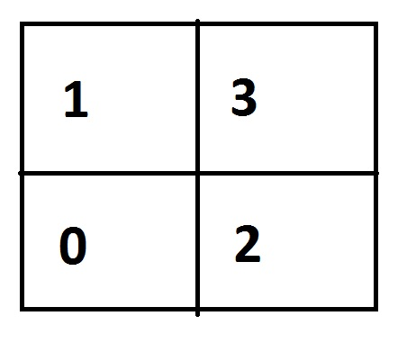
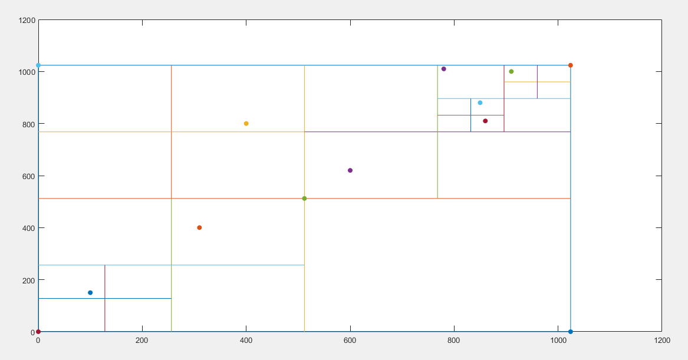
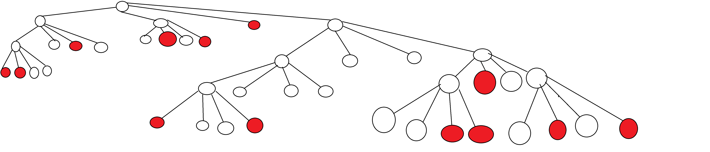

= QuadTree

Dörtlü ağaç,2 boyutlu düzlemin dikdörtgen bölgesi içinde yer alan noktaların depolanması ve incelenmesi konusunda kullanılan bir veri yapısıdır.

* Root : Kök düğüm.Ağacın en tepesinde bulunan ana düğüm.

* Düğüm : Çocuğu olan data saklamayan düğüm.

* Yaprak:Çocuğu olmayan data saklayan düğüm.

== QuadTree Yerleşim

== Örnek Veri Kümesi

Yerleşim 1024x1024 alana yapılacaktır.Bölünme işleminin kolay olması açısından ikinin katları seçilmiştir.

* Koordinat Listesi
[source,cpp]
====
780,1010  

910,1000

850,880  

860,810 

100,150 

310,400 

400,800 

600,620  

512,512  

0,1024  

0,0  

1024,0  

1024,1024
====

== Yerleştirme Algoritması

Ekleme işlemine root kök düğümden başlanır. Gelen data koordinatları ve kök düğümün merkez koordinatları karşılaştırılır.Karşılaştırma işlemi
gelen datanın x koordinatı düğümün merkezinin x koordinatından büyük veya eşit olma durumunda 1 küçük olma durumunda 0 sonucu alır bu sonuç bit shifting yöntemiyle 1 bit sola kaydırılır . Eğer büyükse 2 küçükse 0 değerini alır. Datanın y koordinatı düğümün merkez y koordinatından büyük veya eşit olma durumunda 1 küçük olma durumunda 0 değerini alır.Bu sonuç bit shifting yöntemiyla sola kaydırılır. X ve Y değerleri veya işlemine sokulur ve yerleşim tablomuza göre 0 1 2 3 olarak belirlenir.Düğümün belirlenen çocuğuna gidilir.Bu düğümün yaprak düğüm olup olmadığı kontrol edilir.Eğer yaprak düğüm ve boş ise yeni düğüm oluşturulur ve data buraya eklenir.Eğer düğüm yaprak değilse ekleme işlemi rekürsif olarak devam eder.Yeni düğüm ile data koordinat karşılaştırmaları yapılır ve o düğümün uygun yeri saptanır.Tekrar yaprak mı kontrolü yapılır.Eğer yapraksa ve doluysa yaprak içinde ki veri geçici bir değişkene alınır ve yaprak düğümün içinde ki data boşaltılır.İçinde ki data ve yeni gelen data düğümün içinde yeni oluşturulan yaprak düğümünlere eklenir.

* Örnek veriler sonucu oluşan ağaç yapısı

Kırmızı noktalar dolu düğümleri göstermektedir.

